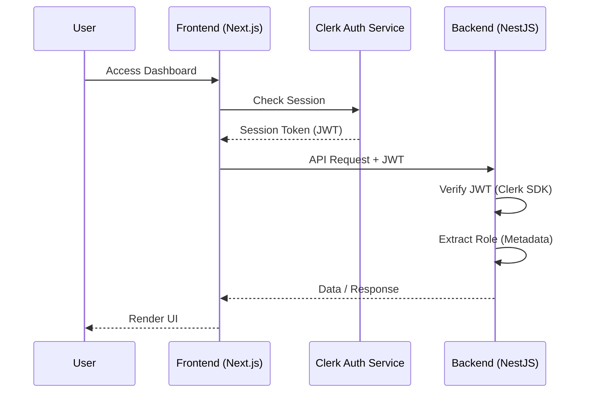

# Auth Flow Workflow — ITSPRELUDE

## Diagram

## Implementation Strategy

### 1. Frontend Migration
- Replace `next-auth` imports with `@clerk/nextjs`.
- Update `app/layout.tsx` to use `ClerkProvider`.
- Update `middleware.ts` to use `clerkMiddleware`.
- Refactor `login/page.tsx` and `register/page.tsx` to use Clerk's `<SignIn />` and `<SignUp />` or custom flows.

### 2. Backend Migration
- Create `ClerkAuthGuard`.
- Replace `JwtAuthGuard` with `ClerkAuthGuard` in controllers.
- Ensure roles are synced from Clerk `publicMetadata`.

### 3. API Client Integration
- Update `api-client.ts` to fetch token using Clerk's `getToken()`.
- Automatically attach `Authorization: Bearer <token>` to all requests.
- Implement 401 handling to redirect to login or clear session.
