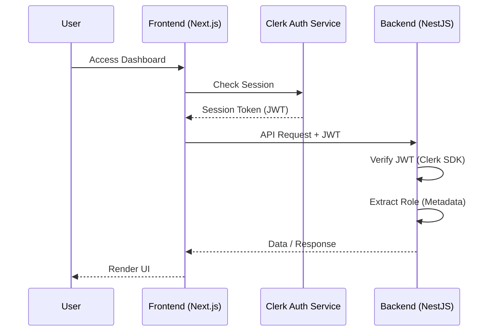

# Project Development & Design Documentation

This document centralizes all technical specifications, authentication workflows, and design system guidelines for the Performance Management System.

---

## 1. Authentication System (Clerk)

### Auth Flow Workflow

### Implementation Strategy
1. **Frontend Migration**: Replace `next-auth` with `@clerk/nextjs`. Wrap root with `<ClerkProvider>`.
2. **Backend Migration**: Implement `ClerkAuthGuard` using `@clerk/backend` for JWT verification.
3. **API Client**: Update `api-client.ts` to automatically attach Clerk tokens to headers.

### Clerk Setup & Research
- **Frontend**: Use `getToken()` hook for client-side API calls.
- **Middleware**: Use `clerkMiddleware()` for route protection.
- **Metadata**: Store roles (`founder`, `manager`, `employee`) in `publicMetadata` for cross-system syncing.

---

## 2. Elite Performance Design System

### Visual Theme
Inspired by high-performance geometric aesthetics — a cathedral of darkness where true black (`#000000`) surfaces meet Performance Gold (`#FFC000`) accents.

### Typography
- **Primary Font**: `PerformanceSans` (custom Neo-Grotesk).
- **Scale**: Hero (120px) down to Micro (10px).
- **Voice**: Uppercase display headlines with tight line-heights (0.92) for a commanding presence.

### Color Palette
| Color | Hex | Role |
|-------|-----|------|
| **Performance Gold** | `#FFC000` | Primary CTA, Saturated Amber |
| **Absolute Black** | `#000000` | Primary Background / Canvas |
| **Charcoal** | `#202020` | Cards & Elevated Surfaces |
| **Pure White** | `#FFFFFF` | Primary Headlines |
| **Ash** | `#7D7D7D` | Secondary / Muted Body Text |

### Components
- **Buttons**: Zero border-radius (sharp corners). Gold for primary actions, Ghost (white border) for secondary.
- **Cards**: Charcoal background sitting on black canvas. No shadows; depth is achieved via surface color layering.
- **Navigation**: Minimal, floating elements. Hamburger menu ("MENU") and centered logo.

---

## 3. Deployment & Repository structure
- **Frontend**: Next.js 16 App Router.
- **Backend**: NestJS with Prisma ORM.
- **Documentation**: All technical specs reside in this `DEVELOPMENT.md` file.
